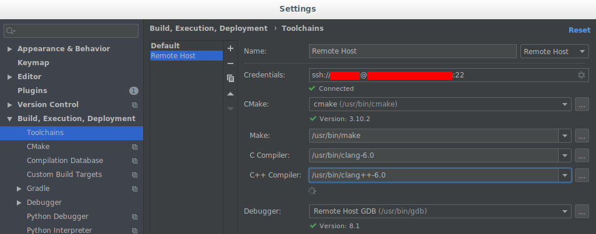
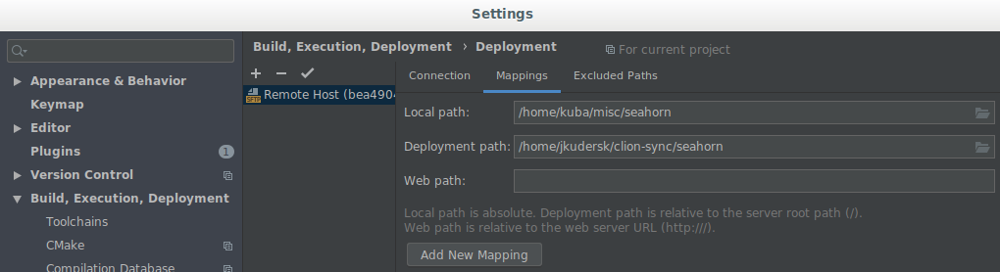
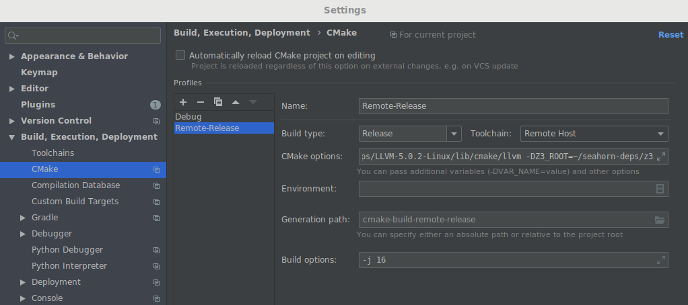
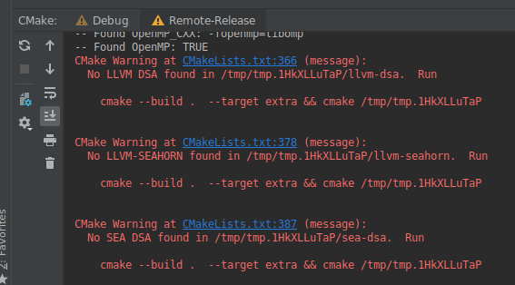
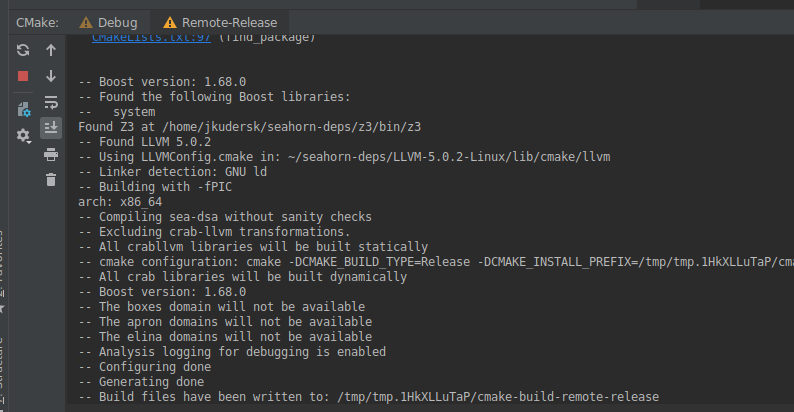

# Remote Developement configuration for the CLion IDE

This document explains how to configure the
[CLion IDE](https://www.jetbrains.com/clion/) for remote development of SeaHorn
and its subprojects. The end results should be a working CLion configuration
supporting building on a remote machine, with a working project indexing
(e.g., jump to definition, refactoring, etc.).

This guide assumes that your remote system is configured with all the necessary
dependencies as explained in
[README](README.md#building-seahorn-on-ubuntu-1804).

## CLion installation

Download and install CLion following the instructions at
https://www.jetbrains.com/clion/download/. Note that JetBrains offers a free
license for academic use https://www.jetbrains.com/student/.

### Instructions for WSL (Windows Subsystem for Linux)
1. [Install WSL with Ubuntu](https://docs.microsoft.com/en-us/windows/wsl/install-win10).
2. Install necessary dependencies.
3. Install CLion on the WSL Ubuntu: follow the
   [CLion installation instructions](https://www.jetbrains.com/help/clion/installation-guide.html?section=Linux#standalone).
4. Install an X Server client on Windows, e.g., [VcXsrv](https://sourceforge.net/projects/vcxsrv/).
5. On Windows, lunch the X Sever client. On Ubuntu, export the display variable,
   e.g., `export DISPLAY=:0`.
6. Run `./path-to-clion/bin/clion.sh`.

## Remote configuration
Based on the [Full Remote Mode guide](https://www.jetbrains.com/help/clion/remote-projects-support.html).
Assumes that the remote host is running an Ubuntu.

1. *On the remote host*, download and unpack the *appropriate* prebuilt 
   dependencies (LLVM, Z3, boost) from
   https://github.com/seahorn/seahorn-ext-deps/releases. For example,
   Ubuntu 18.04 requires dependencies prefixed with `bionic_rel`:
    * `cd ~ ; mkdir seahorn-deps ; cd seahorn-deps`
    * `wget https://github.com/seahorn/seahorn-ext-deps/releases/download/5.0-deep-dev/bionic_rel_boost_1_68.tar.gz`,
      then `tar -xvf bionic_rel_boost_1_68.tar.gz`.
    * `wget https://github.com/seahorn/seahorn-ext-deps/releases/download/5.0-deep-dev/bionic_rel_llvm50.tar.gz`,
      then `tar -xvf bionic_rel_llvm50.tar.gz`.
    * `wget https://github.com/seahorn/seahorn-ext-deps/releases/download/5.0-deep-dev/bionic_rel_z3.tar.gz`,
      then `tar -xvf bionic_rel_z3.tar.gz`.
    * Clean the directory up: `rm *.tar.gz`.
   
   Note that the links and filenames might have been changed.
 
2. On the local machine, clone seahorn and open it as a project in CLion.

3. Open CLion's settings:
    * on Linux: `File` -> `Settings`.
    * on Mac: `CLion` -> `Preferences`.

4. Go to `Build, Execution, Deployment` -> `Toolchains` and click `+` to add a
   new toolchain:
    * Configure the SSH connection and provide paths to the executables:
    
    
    
    * Click the arrow up button to use this toolchain by default and
      confirm with `Apply`.

5. Go to `Build, Execution, Deployment` -> `Deployment` -> `Mappings` and set
   the remote path to some absolute path on the remote machine. This directory,
   that we will refer to as `DEPLOY_DIR`, will be synced with the project
   directory. Note that it is not recommended for `DEPLOY_DIR` to be inside
   `/tmp`, as it may be removed after a restart of the remote machine.
   
   

6. Go to `Build, Execution, Deployment` -> `CMake` and click `+` to add a
   new CMake configuration:
   * Make CLion use the remote toolchain and pass the necessary parameters to 
     CMake.
     
     
     
   * Sample CMake options: 
     ~~~
     -DCMAKE_INSTALL_PREFIX=run
     -DCMAKE_BUILD_TYPE=Release -GNinja -DCMAKE_EXPORT_COMPILE_COMMANDS=1
     -DCMAKE_C_COMPILER="clang-6.0" -DCMAKE_CXX_COMPILER="clang++-6.0"
     -DSEA_ENABLE_LLD=1
     -DBOOST_ROOT=~/seahorn-deps/boost
     -DLLVM_DIR=~/seahorn-deps/LLVM-5.0.2-Linux/lib/cmake/llvm
     -DZ3_ROOT=~/seahorn-deps/z3
     ~~~
   * Confirm with `Apply`.

7. To make remote build work: 
    * Select the `Remote-Release` CMake tab and click the refresh button.
      This is expected to fail and produce an error like this:
      
      
      
      The error indicates where the current local directory is mapped on the
      remote machine and should match the previousely configured deployment
      directory: `DEPLOY_DIR`.
      
    * On the remote host, go to the directory from the error message, and run
      the suggested commands: 
      ```
      cd DEPLOY_DIR
      cd cmake-build-remote-release
      cmake --build .  --target extra && cmake DEPLOY_DIR
      cmake --build .  --target crab && cmake DEPLOY_DIR
      ```
     
8. Make the indexing work:
    * Select the `Remote-Release` CMake tab and click the refresh button again.
      This time CLion should show output like this:
      
      
      
    * Click on `Tools` -> `Resync with Remote Hosts`.


At this point, CLion should be able to index the whole project (this can take a
while) and know how to navigate the code. You can try it by opening a file,
hovering your mouse cursor over a variable or a function, and 
`Ctrl/Command + click` on it -- the IDE should jump to the definition.   
